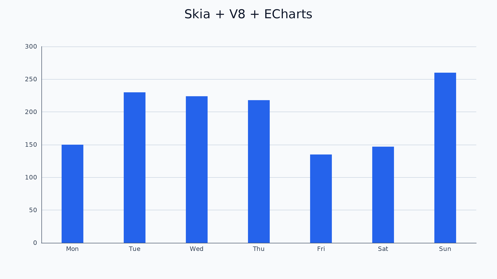
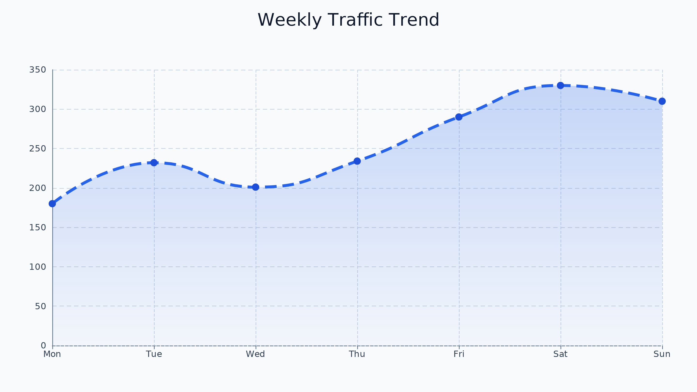
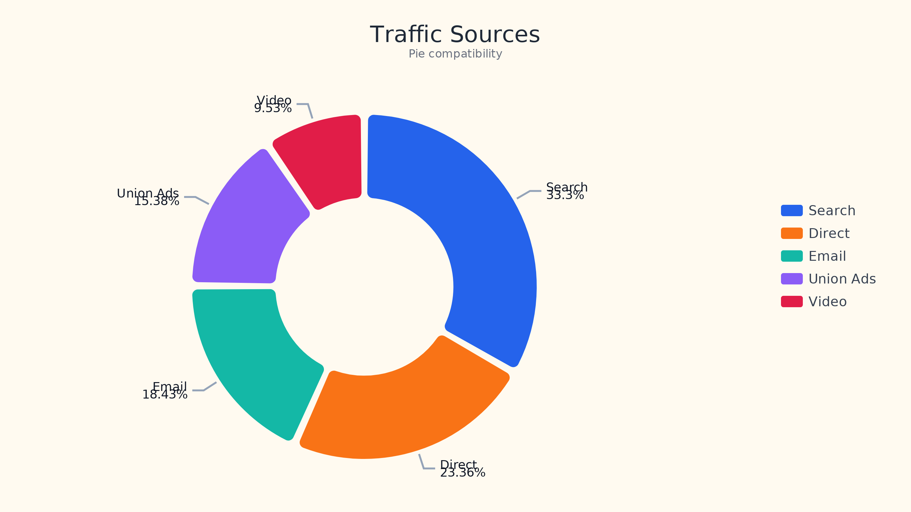
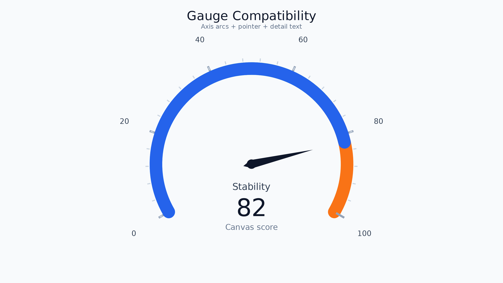
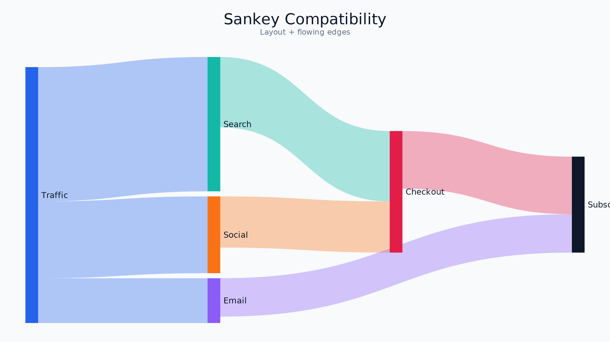
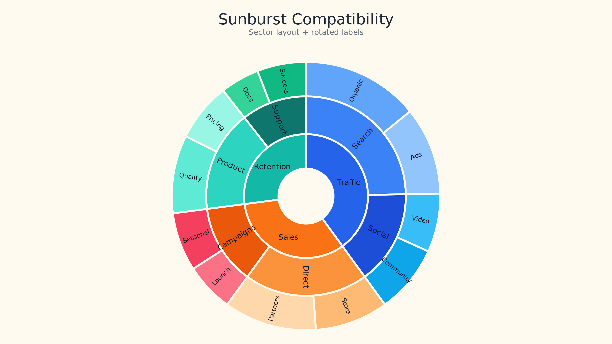

<div align="center">

# 🎨 Skia Painter

**一个基于 C++ + V8 + Skia 的无头 Canvas 后端，把 [Apache ECharts](https://echarts.apache.org/) 渲染链路稳定导出为高清 PNG。**

[](https://github.com/byteluo/skia_painter/actions/workflows/deploy-pages.yml)
[](LICENSE)
[](CMakeLists.txt)
[](https://skia.org/)
[](https://v8.dev/)
[](https://echarts.apache.org/)
[](https://byteluo.github.io/skia_painter/)

[English](README.md) · **中文**

</div>

---

<div align="center">








<sub>demo 画廊里的几个示例 —— 全部 50+ 图表见<a href="https://byteluo.github.io/skia_painter/">在线对比 demo</a>。</sub>

</div>

---

## 简介

**Skia Painter** 是一个基于 `C++ + V8 + Skia` 的 Canvas 后端引擎。它的目标**不是**完整实现浏览器 DOM，而是提供一套足够驱动 **ECharts** canvas 渲染链路的宿主运行时，并把结果稳定导出为高清 PNG。

它能够：

- 通过 **V8** 执行 JavaScript
- 通过 **Skia** 完成 2D 栅格绘制
- 提供 `Canvas` / `CanvasRenderingContext2D` / `Image` 宿主对象
- 直接加载 **ECharts** UMD 产物并完成 canvas 渲染
- 默认导出高清 PNG
- 提供冒烟测试与渲染回归测试

## 为什么做这个？

服务端渲染图表通常要么跑无头浏览器（Puppeteer/Playwright），要么用 `node-canvas`。Skia Painter 走了一条更轻的路：一个原生二进制启动 V8，把 Skia 支持的 canvas 交给 ECharts，然后写出 PNG —— 没有浏览器、没有显示服务器、没有 DOM。

## 当前状态

这套工程已经不是“骨架”，而是一套**可运行的最小 Canvas 渲染后端**，稳定支持：

- 本地脚本加载：`loadScript(path)`
- 本地图片解码：`new Image()` + `image.src = "..."`
- 2D 路径、文本、阴影、虚线、渐变、pattern、像素读写
- `requestAnimationFrame` / `setTimeout` 的最小任务队列语义
- 默认高清导出

**默认渲染策略：**

- 内部 backing store 默认使用 `DPR = 3`
- `canvas.saveToPng(path)` 默认直接导出 backing store 分辨率
- 例如逻辑尺寸 `960×540`，导出 PNG 默认是 `2880×1620`

**路径语义：** `loadScript(path)`、`image.src = path`、`canvas.saveToPng(path)` 的相对路径都按“**当前脚本文件所在目录**”解析，而不是进程启动目录。

## 快速开始

> 默认 bootstrap 目标是 **macOS + Homebrew**，同时也提供 Linux 脚本（`scripts/bootstrap_linux.sh`）。

```bash
# 带子模块克隆
git clone --recursive https://github.com/byteluo/skia_painter.git
cd skia_painter

# 一键安装 + 构建 + 测试
./scripts/bootstrap.sh          # debug
./scripts/bootstrap.sh release  # release
```

该脚本会安装 Homebrew 依赖、配置 `JAVA_HOME`、初始化 `third_party/skia`、构建最小 Skia 产物，然后配置、编译并运行测试。

强制重建 Skia：

```bash
FORCE_SKIA_BUILD=1 ./scripts/bootstrap.sh
```

## 运行示例

```bash
mkdir -p output
./build/dev/canvas_engine examples/echarts_bar.js
# 或者直接构建到 ./build 时：
./build/canvas_engine examples/echarts_bar.js
# 或运行基础 demo：
./scripts/run_demo.sh
```

## 与浏览器对比

启动一个本地 dev 服务，上半部分是**浏览器原生 ECharts canvas 渲染**，下半部分是**当前后端导出的 PNG**，方便上下对比视觉效果：

```bash
npm run dev:compare          # 默认 http://127.0.0.1:8787
```

对比页面已覆盖仓库里全部 `examples/echarts_*.js`。二进制不在默认位置时：

```bash
CANVAS_ENGINE_BIN=/absolute/path/to/canvas_engine npm run dev:compare
```

## 使用 CMake Presets 构建

```bash
cmake --preset dev      && cmake --build --preset dev      && ctest --preset dev
cmake --preset release  && cmake --build --preset release  && ctest --preset release
# 输出目录：build/dev、build/release
```

## 集成 ECharts

推荐直接加载 ECharts 的 UMD 构建，并用宿主提供的 `Canvas` 作为渲染目标：

```js
loadScript("../node_modules/echarts/dist/echarts.js");

const width = 960;
const height = 540;
const canvas = new Canvas(width, height);
canvas.style = {};

echarts.setPlatformAPI({
  createCanvas() {
    const next = new Canvas(width, height);
    next.style = {};
    return next;
  },
  loadImage(src, onload) {
    const image = new Image();
    if (typeof onload === "function") image.onload = onload;
    image.src = src;
    return image;
  }
});

const chart = echarts.init(canvas, null, { renderer: "canvas", width, height });

// ... setOption ...

chart.getZr().refreshImmediately();
canvas.saveToPng("../output/chart.png");
```

## 已验证的 ECharts 图表

下面 50+ 个示例都已在当前仓库实际跑通并导出 PNG（基于 `echarts@6.0.0`），内建 core chart series 已全部有示例覆盖。

| 分类 | 图表 |
| --- | --- |
| **基础图表** | bar · boxplot · line · pie · scatter · effectScatter · candlestick · funnel · gauge · radar · heatmap · calendar heatmap |
| **图关系与流向** | graph · map · sankey · lines · parallel · themeRiver |
| **层级与布局** | tree · treemap · sunburst |
| **自定义与组件** | custom series · pictorialBar · timeline · dataZoom+markArea · markPoint+markLine · toolbox · brush · dataset+transform · legend scroll · axisPointer · visualMap · piecewise visualMap · multi-grid axisPointer · toolbox magicType / dataZoom · legend selected |
| **坐标系与容器** | polar · singleAxis · calendar · geo · geo+effectScatter · geo+lines · map+piecewise visualMap · map+scatter+visualMap |
| **图片/富文本/混合** | image scatter · rich graphic · pattern bar · geo heatmap |

完整示例索引见 [`examples/`](examples/) 目录。

## 已实现 API

<details>
<summary><b>宿主对象</b></summary>

`new Canvas(width, height)` · `canvas.width` · `canvas.height` · `canvas.getContext("2d")` · `canvas.saveToPng(path)` · `canvas.setAttribute(name, value)` · `canvas.addEventListener(...)` · `canvas.removeEventListener(...)`

`new Image()` · `image.width` · `image.height` · `image.src` · `image.complete` · `image.onload` · `image.onerror`
</details>

<details>
<summary><b>2D Context</b></summary>

**状态：** `fillStyle` · `strokeStyle` · `lineWidth` · `font` · `textAlign` · `textBaseline` · `globalAlpha` · `globalCompositeOperation` · `lineCap` · `lineJoin` · `miterLimit` · `shadowBlur` · `shadowColor` · `shadowOffsetX` · `shadowOffsetY` · `lineDashOffset`

**变换：** `save` · `restore` · `translate` · `scale` · `rotate` · `transform` · `setTransform` · `resetTransform`

**矩形：** `clearRect` · `fillRect` · `strokeRect`

**路径：** `beginPath` · `moveTo` · `lineTo` · `quadraticCurveTo` · `bezierCurveTo` · `rect` · `arc` · `arcTo` · `ellipse` · `closePath` · `clip` · `fill` · `stroke`

**虚线 / 样式工厂：** `setLineDash` · `getLineDash` · `createLinearGradient` · `createRadialGradient` · `createPattern`

**文本：** `measureText` · `fillText` · `strokeText`

**图片 / 像素：** `drawImage` · `getImageData` · `putImageData`
</details>

<details>
<summary><b>全局能力</b></summary>

`print(...)` · `console.log/warn/error` · `loadScript(path)` · `setTimeout` · `clearTimeout` · `requestAnimationFrame` · `cancelAnimationFrame` · `performance.now()`
</details>

## 测试

```bash
ctest --test-dir build --output-on-failure   # 全部测试
ctest --preset dev                            # 通过 preset
python3 scripts/verify_compare_coverage.py    # 只跑 compare 覆盖校验
```

三类测试：**冒烟测试**（V8 宿主 + 脚本执行链路）、**渲染回归**（高清导出、图片绘制、曲线、椭圆、`arcTo`、`ImageData`、任务队列冲刷语义）、**compare 覆盖**（每个 `examples/echarts_*.js` 都已接入 `web/compare/cases.json`）。

## 性能对比

和服务端渲染 ECharts 的常见做法相比，从架构上看：

| 方案 | 渲染目标 | 输出 | 需要浏览器？ | 需要 DOM？ |
| --- | --- | --- | --- | --- |
| **Skia Painter**（本项目） | Skia（原生 2D） | PNG（栅格，高清） | 否 | 否 |
| **无头 Chrome**（Puppeteer/Playwright） | 浏览器合成器 | PNG / 截图 | 是（约 150–300 MB） | 是 |
| **node-canvas + ECharts** | Cairo | PNG（栅格） | 否 | 否 |
| **ECharts SVG SSR** | — | SVG（矢量字符串） | 否 | 否 |

仓库里有一套**可复现的基准 harness** [`bench/benchmark.mjs`](bench/benchmark.mjs)：把*同一组* ECharts option 喂给每个可用后端并打印 Markdown 表格。依赖缺失的后端会被跳过，绝不编造数字：

```bash
npm i -D canvas puppeteer        # 可选的对比方案
node bench/benchmark.mjs         # ITERATIONS=50 可加大采样
```

本地没有工具链？[`Benchmark` workflow](.github/workflows/benchmark.yml) 会在干净的 Ubuntu runner 上构建引擎并在云端跑 harness（手动触发）。方法学、注意事项（PNG 与 SVG 是不同产物；无头 Chrome 是视觉*参考*实现）以及示例数据见 [`docs/benchmarks.md`](docs/benchmarks.md)。**引用任何数字前请在你自己的硬件上重新测量。**

## 已知限制

这套运行时是“**面向渲染导出**”的最小宿主，不是浏览器环境，也不是完整 `node-canvas` 替代品：

- 没有 DOM、CSSOM、布局系统
- `Image.src` 目前只支持本地文件路径，不支持 `http(s)` URL
- 没有完整事件系统（`addEventListener` 主要用于兼容占位）
- 没有 `Path2D`、`isPointInPath` / `isPointInStroke`、`createImageData`
- 没有完整浏览器级异步事件循环

**定时器语义：** `requestAnimationFrame` / `setTimeout` 不再是“立即同步执行”，它们会进入最小任务队列，在脚本执行末尾和 `saveToPng()` 前统一 drain。足以支撑 ECharts/zrender 的刷新链，但不是通用事件循环。

## 路线图

- 补 `Path2D`
- 更完整的像素 API（如 `createImageData`）
- 命中测试 API
- 更接近浏览器的定时器 / 事件循环语义
- 把 ECharts 兼容矩阵系统化成自动化回归

## 目录结构

```text
.
├── CMakeLists.txt / CMakePresets.json
├── examples/              # ECharts 与冒烟示例
├── include/canvas_engine/ # 公共头文件（canvas/、runtime/）
├── scripts/               # bootstrap、构建、dev 服务、校验脚本
├── src/                   # canvas/（2D、surface、image）、runtime/（V8 绑定）
├── web/                   # 浏览器 vs 后端 对比页面
└── third_party/skia       # Skia 子模块
```

核心实现：

- 2D 绘制 —— [`src/canvas/Canvas2DContext.cc`](src/canvas/Canvas2DContext.cc)
- Surface / PNG 导出 —— [`src/canvas/CanvasSurface.cc`](src/canvas/CanvasSurface.cc)
- 图片解码 —— [`src/canvas/ImageAsset.cc`](src/canvas/ImageAsset.cc)
- V8 绑定与宿主运行时 —— [`src/runtime/ScriptEngine.cc`](src/runtime/ScriptEngine.cc)

pin 的第三方版本 —— Skia：`31521f8508c712615b3d35e8e4554ccb5bf568e1`，V8：`15.0.39`。

## 参与贡献

欢迎贡献！开发环境、对比工作流、以及如何新增一个 ECharts 示例，请见 [CONTRIBUTING.md](CONTRIBUTING.md)。参与即表示你同意遵守[行为准则](CODE_OF_CONDUCT.md)。

## 许可证

基于 [MIT License](LICENSE) 开源。
